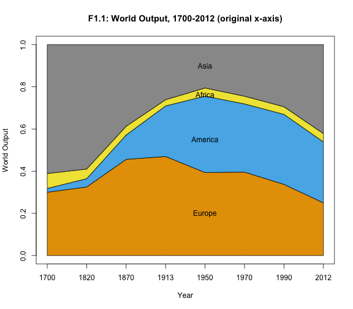
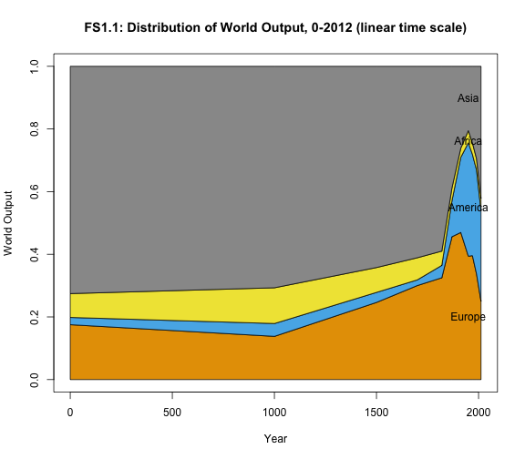

Capital in the 21st Century: Chapter 0
========================================================

### Data provenance

The data were downloaded as Excel files from: http://piketty.pse.ens.fr/en/capital21c2. 

### Loading relevant libraries and data

This document depends on the [xlsx](http://cran.r-project.org/web/packages/xlsx/index.html), [reshape2](http://cran.r-project.org/web/packages/reshape2/index.html), and [googleVis](http://cran.r-project.org/web/packages/ggplot2/index.html) packages.


```r
library(ggplot2)
library(xlsx)
library(reshape2)

tsi1 = read.xlsx("./Piketty2014FiguresTables/Chapter0TablesFigures.xlsx", sheetName = "TSI.1", 
    rowIndex = 7:107, colIndex = 1:2, header = FALSE)
names(tsi1) = c("year", "top10is")


tsi2 = read.xlsx("./Piketty2014FiguresTables/Chapter0TablesFigures.xlsx", sheetName = "TSI.2", 
    rowIndex = 6:20, colIndex = 1:4, header = FALSE)
names(tsi2) = c("year", "germany", "france", "britain")
tsi2 = melt(tsi2, id.vars = c("year"))
names(tsi2) = c("year", "Country", "ciratio")
```


## Make FI.1

This code remakes Figure FI.1. 


```r
qplot(year, top10is, data = tsi1, geom = c("point", "line"), xlab = "Year", 
    ylab = "Share of top decile in national income")
```

 


## Make FI.2

This code remakes Figure FI.2. 


```r
ggplot(data = tsi2, aes(x = year, y = ciratio, group = Country, colour = Country)) + 
    geom_line() + geom_point() + ylab("Market value of private capital (% national income)") + 
    xlab("Year")
```

 


