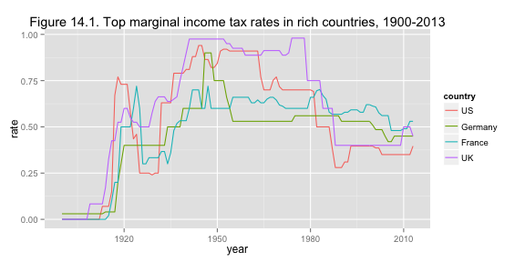
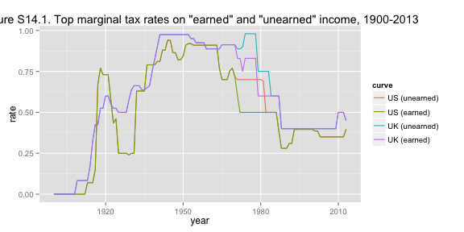
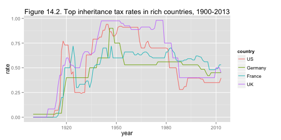

Capital in the 21st Century: Chapter 14
========================================================

### Data provenance

The data were downloaded as Excel files from http://piketty.pse.ens.fr/en/capital21c2. 

### Loading relevant libraries and data

This document depends on the [xlsx](http://cran.r-project.org/web/packages/xlsx/index.html), [reshape2](http://cran.r-project.org/web/packages/reshape2/index.html), and [ggplot2](http://cran.r-project.org/web/packages/ggplot2/index.html) packages.


```r
library(ggplot2)
```

```
## Warning: package 'ggplot2' was built under R version 3.0.2
```

```r
library(xlsx)
```

```
## Warning: package 'xlsx' was built under R version 3.0.2
## Warning: package 'rJava' was built under R version 3.0.2
## Warning: package 'xlsxjars' was built under R version 3.0.2
```

```r
library(reshape2)
```

```
## Warning: package 'reshape2' was built under R version 3.0.2
```

## Table TS14.1


```r
ts141 = read.xlsx("../Piketty2014FiguresTables/Chapter14TablesFigures.xlsx", sheetName="TS14.1", rowIndex=5:118, colIndex=c(1:5, 7:16), header=FALSE)
names(ts141) = c("year","US", "UK", "Germany", "France", "US (top marginal rate on earned income)", "US (top effective rate)", "UK (top marginal rate on earned income)", "France (income tax)", "France (CSG)", "Japan (Saez-Morigushi [sic] Table A0)")
```

For data on the US, France, and Germany, sources are discussed below the table:

> US: The top marginal income tax rate reported here includes general income tax supplements (i.e. surtaxes applying to all incomes above a certain level), but excludes all other taxes and social contributions (the uncapped rate of social security contributions on top earnings has been 2.5% since 1994 and was 0% before). Between 1971 and 1981, the top rate applying to earned income was lower than the top rate applying to ordinary unearned income (e.g. capital income). Also, between 1944 and 1963, there was a maximum top effective rate. Here we do not mention the reduced rates applying to capital gains. See Saez, Slemro and Gierz (2011, Table A1) for more details. See also Tax Policy Center website.

> France: The top marginal income tax rate reported here includes general income tax supplements (i.e. surtaxes applying to all incomes above a certain level) and the CSG (a proportional income tax applying to all incomes), but excludes all other taxes (e.g. corporate taxes) and social contributions (except the CSG). Between 1919 and 1958, top rates were higher for single taxpayers (e.g. during the interwar period, singles paid a 25% tax surcharge, so that the top rate was 62.5% rather than 50% in 1919-1922, 75% rather than 60% in 1923, etc.); there were also smaller tax surcharges for married taxpayers with no children after three years of marriage. All these tax surcharges were excluded here, because they apply only to a minority of top income taxpayers. For complete details about the history of income tax law in France, see Piketty 2001, Chapters 3-4.

> Germany: The top marginal income tax rate reported here includes general income tax supplements (i.e. surtaxes applying to all incomes above a certain level), but excludes all other taxes and social contributions. In 1946-1948 the top rate was set by the Allied Control Council. See Dell (2008) for more details.

The data for Japan are from "Saez-Morigushi [sic] Table A0," which is "The Evolution of Income Concentration in Japan, 1886-2005: 
Evidence from Income Tax Statistics," by Chiaki Moriguchi and Emmanuel Saez; it is available at http://eml.berkeley.edu/~saez/moriguchi-saezRESTAT07japan.pdf .

The data for the UK have several notes and sources listed in a separate table. These are the notes preceding that table:

> Detailed series on UK top income tax rates (data provided by A.B. Atkinson, september 2011)  			
				
> Super-tax was introduced in 1908 and was renamed surtax with effect from 1928-9.				
> The income tax does not include National Insurance contributions.				
> No account is taken of the Special Contribution levied on investment income in 1949.				
> No account is taken of the Special Charge on investment income in 1968.				
> The investment income surcharge was abolished in 1984.				
> For 1971/2 and 1972/3 earned income relief (EIR) applied to all earnings; in all other years, there was a maximum.				
> EIR is therefore only taken into account for these years, reducing taxable earned income by 15 per cent.				
> Source HMRC website, table TA.1.				
> Tax rates refer to the year of assessment; the income subject to the tax may have arisen in a previous year.				
> Reference	Sabine, B E V, 1966, A history of income tax, Allen and Unwin, London.			

For convenience, code for retrieving the table itself follows.

## Table DetailsTS14.1UK

```r
detailsts141uk = read.xlsx("../Piketty2014FiguresTables/Chapter14TablesFigures.xlsx", sheetName="DetailsTS14.1UK", rowIndex=15:117, colIndex=c(1:12), header=FALSE)
names(detailsts141uk) = c("year", "highest rate of tax on earned income", "highest rate of  tax on capital income", "highest rate of income tax", "source", "highest rate of surtax", "source", "investment income surcharge", "source", "notes", "[Unknown]", "[Unknown]")
```

The columns labeled [Unknown] above are present in the table but unlabeled.

## Table TS14.2


```r
ts142 = read.xlsx("../Piketty2014FiguresTables/Chapter14TablesFigures.xlsx", sheetName="TS14.2", rowIndex=5:118, colIndex=c(1:5), header=FALSE)
names(ts142) = c("year","US", "UK", "Germany", "France")
```

For data on the US, France, and Germany, sources are discussed below the table:

> US : The top inheritance tax rate reported here includes only the federal estate tax (not the additional state-level estate and inheritance taxes). See Kopczuk and Saez (2004) for more details. Note that strictly speaking the new 35% top rate started to apply only to 2011 decedents onwards. For year 2010 decedents (repel year), there was actually no federal estate tax (but a 15% tax on capital gains did apply, though).

> France: The top inheritance tax rate reported here is the top rate applying to the decedent's children. It also includes the "taxe successorale" applied in 1917-1934 (top rate with two children) and the maximum effective tax rate applied in 1927-1958. See Piketty (2001, Appendix J) for more details.

> Germany: The top inheritance tax rate reported here is the top rate applying to the decedent's children. In 1946-1948 the top rate was set by the Allied Control Council. See Beckert (2008) and Dell (2008) for more details.

The data for the UK have several notes and sources listed in a separate table. These are the notes preceding that table:

> Detailed series on UK top inheritance tax rates (data provided by A.B. Atkinson, september 2011)  				
					
> Estate Duty was introduced in 1894 					
> Estate duty was replaced in 1975 by Capital Transfer Tax, renamed in 1986 Inheritance Tax					
> The main sources are the Annual Reports (AR) of the Inland Revenue and Inland Revenue Statistics (IRS)					
> Notes					
> a	NA means tax not in operation			
> b	Data relate to tax years				
> c	Where change made other than at start of tax year (6 April), allocate to that year if before 6 October.				
> d	Inland Revenue is now known as HMRC.

Above, NA is a "transliteration" of a yellow box in Excel and is applicable only to the columns "maximum rate of estate duty", "capital transfer tax," and "rate of inheritance tax" of the table. Code for retrieving the table is provided below for convenience.

## Table DetailsTS14.2UK

```r
detailsts142uk = read.xlsx("../Piketty2014FiguresTables/Chapter14TablesFigures.xlsx", sheetName="DetailsTS14.2UK", rowIndex=14:131, colIndex=c(1:7), header=FALSE)
names(detailsts142uk) = c("year", "maximum rate of ED/CTT/IHT", "maximum rate of estate duty", "capital transfer tax", "rate of inheritance tax",  "source", "notes")
```

Figures generated from the tables above follow.

## Figure 14.1


```r
f141dat <- ts141[, c("year", "US", "Germany", "France", "UK")]
molten <- melt(f141dat, id.var = "year")
names(molten) <- c("year", "country", "rate")
plt <- ggplot(molten, aes(x = year, y = rate, color = country)) + geom_line()
plt <- plt + ggtitle("Figure 14.1. Top marginal income tax rates in rich countries, 1900-2013")
plt
```

 

## Figure S14.1


```r
fs141dat <- ts141[, c("year", "US", "US (top marginal rate on earned income)", "UK", "UK (top marginal rate on earned income)")]
names(fs141dat) <- c("year", "US (unearned)", "US (earned)", "UK (unearned)", "UK (earned)")
molten <- melt(fs141dat, id.var = "year")
names(molten) <- c("year", "curve", "rate")
plt <- ggplot(molten, aes(x = year, y = rate, color = curve)) + geom_line()
plt <- plt + ggtitle("Figure S14.1. Top marginal tax rates on \"earned\" and \"unearned\" income, 1900-2013")
plt
```

 

## Figure 14.2


```r
f142dat <- ts142[, c("year", "US", "Germany", "France", "UK")]
molten <- melt(f141dat, id.var = "year")
names(molten) <- c("year", "country", "rate")
plt <- ggplot(molten, aes(x = year, y = rate, color = country)) + geom_line()
plt <- plt + ggtitle("Figure 14.2. Top inheritance tax rates in rich countries, 1900-2013")
plt
```

 

