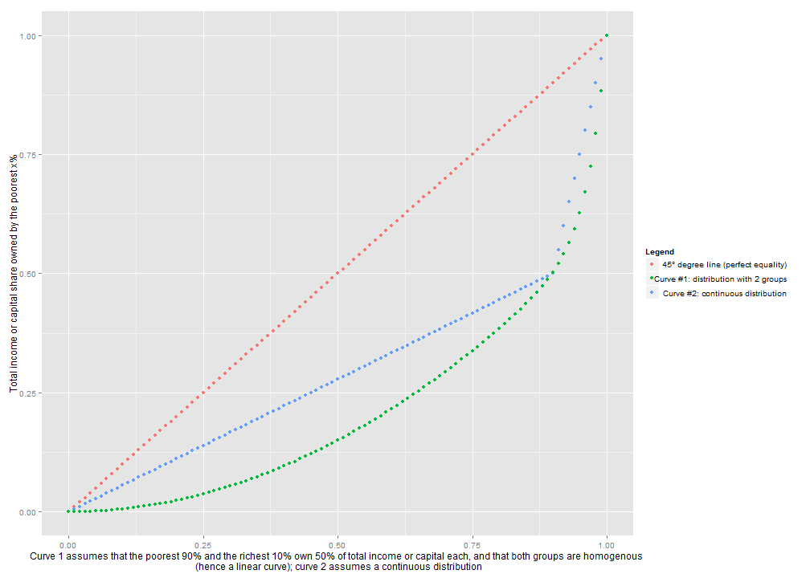

Capital in the 21st Century: Chapter 7
========================================================

### Data provenance

The data were downloaded as Excel files from: http://piketty.pse.ens.fr/en/capital21c2. 

### Loading relevant libraries and data

This document depends on the [xlsx](http://cran.r-project.org/web/packages/xlsx/index.html), [reshape2](http://cran.r-project.org/web/packages/reshape2/index.html), and [ggplot2](http://cran.r-project.org/web/packages/ggplot2/index.html) packages.

Below, we separately load the data required to make each figure.


```r
library(ggplot2)
library(xlsx)
library(reshape2)

#First we'll make a quick function for melting and renaming tables
melt_name<-function(x,name,id.vars="Year",...){
  #if all measurements are missing for a given year, we will generate a versionof the figure with interpolations for that year.
  #We'll show both interpolated and non interpolated figures
  NArows<-apply(x,1,function(r) {all(is.na(r[-1]))} )
  out_interp<-melt(x[!NArows,],id.vars=id.vars,...)
  out_raw<-melt(x,id.vars=id.vars,...)
  list(out_interp,name,out_raw)
}


#####################################

# Spread Sheet TS7.7

# Inequality of labor income across time and space

#####################################

#Gini-Lorenz curves
ts7.7 = read.xlsx("../Piketty2014FiguresTables/Chapter7TablesFigures.xlsx",sheetName="TS7.7",rowIndex=8:108,colIndex=1:3,header=FALSE)
names(ts7.7) <- c("x","linear","continuous")
```

## Recreate Figures

There is basically only one figure in this chapter, the rest are all tables


```r
baseline <- expression(paste("45",degree," degree line (perfect equality)"))
ggplot(data=ts7.7)+
  geom_point(aes(x=x,y=x,color= 'black')) +
  geom_point(aes(x=x,y=linear,color= 'red')) +
  geom_point(aes(x=x,y=continuous,color= 'green')) +
  ylab('Total income or capital share owned by the poorest x%') +
  xlab('Curve 1 assumes that the poorest 90% and the richest 10% own 50% of total income or capital each, and that both groups are homogenous \n (hence a linear curve); curve 2 assumes a continuous distribution') + 
  scale_color_discrete("Legend", labels = c(baseline, "Curve #1: distribution with 2 groups", "Curve #2: continuous distribution"))
```

 
