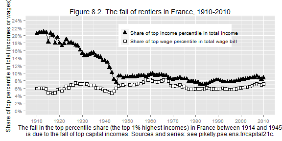

Capital in the 21st Century: Chapter 8
========================================================

### Data provenance

The data were downloaded as Excel files from: http://piketty.pse.ens.fr/en/capital21c2. 

### Loading relevant libraries and data

This document depends on the [xlsx](http://cran.r-project.org/web/packages/xlsx/index.html), [reshape2](http://cran.r-project.org/web/packages/reshape2/index.html), and [ggplot2](http://cran.r-project.org/web/packages/ggplot2/index.html) packages.


```r
library(ggplot2)
library(xlsx)
library(reshape2)
```

## Figures 8.1 and Supplementary Figures

These figures are based on Table TS8.1. Here we read
data from the excel file and name the data series. Note that in a separate section the calculations upone which TS8.1 are based are recalculated.


```r
## Table TS8.1
fname="../Piketty2014FiguresTables/Chapter8TablesFigures.xlsx"
ts81 = read.xlsx(fname,sheetName="TS8.1",rowIndex=6:116,colIndex=1:6,header=FALSE)
names(ts81) = c("year","top_10percent_income_share","top_1percent_income_share",
                "top_0.1percent_income_share", "top_10percent_wage_share", "top_1percent_wage_share")
```

```r
sheetname="DetailsWTIDSeries"
tabWTID<-read.xlsx(fname,sheetName=sheetname,rowIndex=7:147,colIndex=1:126,header=FALSE)
```
The caption of the table lists the sources for this table
as 

>Top income shares series based upon WTID series; missing values interpolated using moving averages and top 5% and top 1% series (see formulas and "Details" sheet)
>Top wage series: Piketty 2001 (figure 3.2) (missing values for 1910-1918, 1939-1946, and 1999-2010 interpolated using income series and composition series, and series from Landais 2007 and Godechot 2012)

Now we make Figure F8.1


```r
#TODO: confirm calculations in table. for example 1909 and 1911 top 10% income shares are interpolated

f81dat <- ts81[,c("year","top_10percent_income_share", "top_10percent_wage_share")]
names(f81dat) <- c("year","income","wage")
f81dat<-melt(f81dat,id=c("year"))
#remove years < 1910, which have many NAs
f81dat<-f81dat[f81dat$year>1909,]

mybreaks=seq(0.2,0.5,0.05)
mylabels=paste(as.character(mybreaks*100),"%",sep="")
xname<-"Inequality of total income (labor and capital) has dropped in France during the 20th century,
        while wage inequality has remained the same. Sources and series:
        see piketty.pse.ens.fr/capital21c."
yname<-"Share of top decile in total (incomes or wages)"
legend.labels<-c("Share of top income decile in total income","Share of top wage decile in total wage bill")


plt <- ggplot(data=f81dat,aes(x=year,y=value,group=variable,shape=variable))+geom_line()
plt <- plt+geom_point(aes(shape=variable,fill=variable),size=3)
plt <- plt+scale_shape_manual(values=c(24,22),labels=legend.labels)
plt <- plt+scale_fill_manual(values=c("black","white"),labels=legend.labels)
plt <- plt+scale_y_continuous(limits=c(.2,.5),breaks=mybreaks,labels=mylabels,
                              name=yname)
plt <- plt+scale_x_continuous(breaks=seq(1910,2010,10),name=xname)
plt <- plt + ggtitle("Figure 8.1. Income inequality in France, 1910-2010")
plt <- plt + theme(legend.title=element_blank(),legend.position=c(.6,.8))

print(plt)
```

 

And Figure 8.2


```r
f82dat <- ts81[,c("year","top_1percent_income_share", "top_1percent_wage_share")]
names(f82dat) <- c("year","income","wage")
f82dat<-melt(f82dat,id=c("year"))
#remove years < 1910, which have many NAs
f82dat<-f82dat[f82dat$year>1909,]

mybreaks=seq(0,.24,.02)
mylabels=paste(as.character(mybreaks*100),"%",sep="")
xname<-"The fall in the top percentile share (the top 1% highest incomes) in France between 1914 and 1945
is due to the fall of top capital incomes. Sources and series: see piketty.pse.ens.fr/capital21c."
yname<-"Share of top percentile in total (incomes or wages)"
legend.labels<-c("Share of top income percentile in total income","Share of top wage percentile in total wage bill")


plt <- ggplot(data=f82dat,aes(x=year,y=value,group=variable,shape=variable))+geom_line()
plt <- plt+geom_point(aes(shape=variable,fill=variable),size=3)
plt <- plt+scale_shape_manual(values=c(24,22),labels=legend.labels)
plt <- plt+scale_fill_manual(values=c("black","white"),labels=legend.labels)
plt <- plt+scale_y_continuous(limits=c(0,.24),breaks=mybreaks,labels=mylabels,
                              name=yname)
plt <- plt+scale_x_continuous(breaks=seq(1910,2010,10),name=xname)
plt <- plt + ggtitle("Figure 8.2. The fall of rentiers in France, 1910-2010")
plt <- plt + theme(legend.title=element_blank(),legend.position=c(.6,.8))

print(plt)
```

 


```r
## Table TS8.1
fname="../Piketty2014FiguresTables/Chapter8TablesFigures.xlsx"
ts83a = melt(read.xlsx(fname,sheetName="TS8.3",rowIndex=5:11,colIndex=1:7,header=TRUE))
numentries=nrow(ts83a)
ts83a$country<-rep("France",numentries)
ts83a$capital.gains<-factor(rep("NA",numentries))
ts83a$year<-rep(c("1932","2005"),each=numentries/2)

ts83b = melt(read.xlsx(fname,sheetName="TS8.3",rowIndex=14:20,colIndex=1:7,header=TRUE))
numentries=nrow(ts83b)
ts83b$country<-rep("USA",numentries)
ts83b$capital.gains<-factor(rep("with.capital.gains",numentries))
ts83b$year<-rep(c("1929","2007"),each=numentries/2)

ts83c = melt(read.xlsx(fname,sheetName="TS8.3",rowIndex=23:29,colIndex=1:7,header=TRUE))
numentries=nrow(ts83c)
ts83c$country<-rep("USA",numentries)
ts83c$capital.gains<-factor(rep("no.capital.gains",numentries))
ts83c$year<-rep(c("1929","2007"),each=numentries/2)

#combine all three and get rid of spurious .1 appended in melt
ts83<-rbind(ts83a,ts83b,ts83c)
ts83$variable<-sub("income.1","income",ts83$variable)

names(ts83)<-c("group","income.type","income.percentage","country","capital.gains","year")
```


